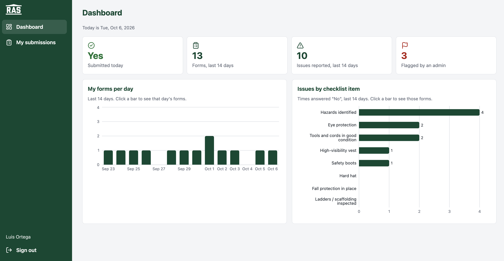
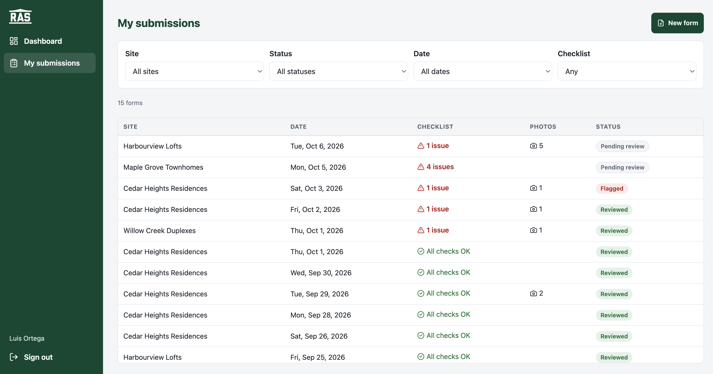
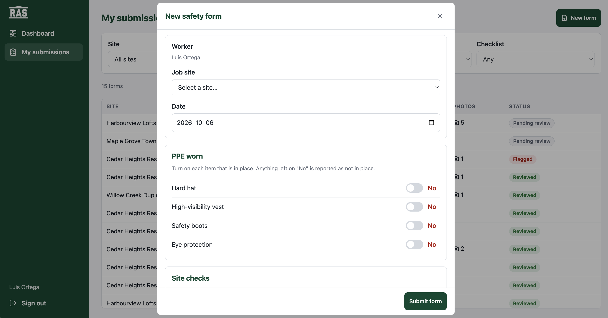
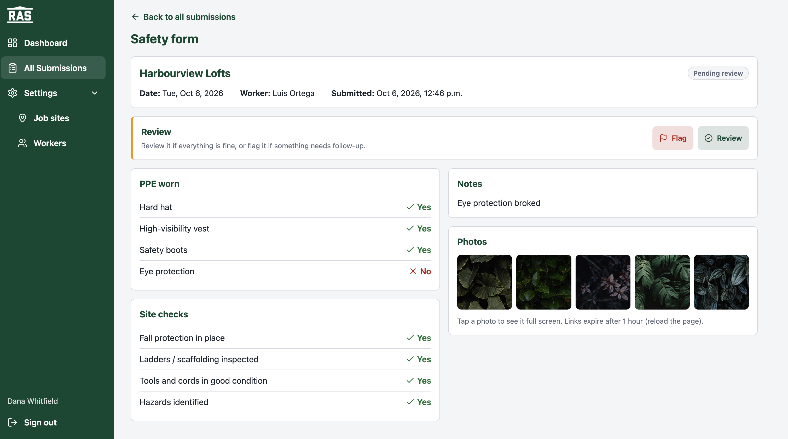
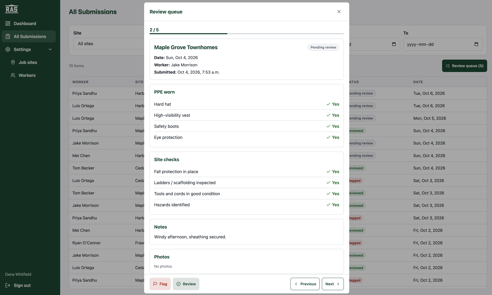
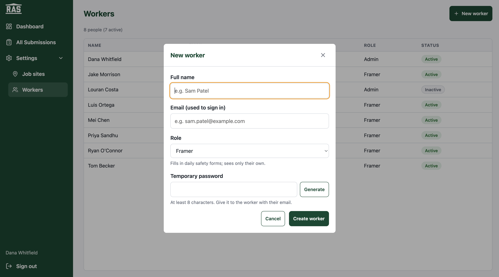

# RAS Site Safety Forms

A web app that emulates an internal RAS (Ron Anderson & Sons) tool. Before starting work, framers fill in a
daily safety form for their job site from their phone, with a checklist, notes and photos. Admins see who has
submitted, on which site and when, review each form and flag anything that needs follow-up.

Built as the technical assessment for the Junior Software Developer role.

- **Live app:** _add the Vercel URL here_
- **ERD:** [doc/ras-erd.png](doc/ras-erd.png) (source: [doc/erd.dbml](doc/erd.dbml), made with dbdiagram.io)
- **Test credentials:** one Admin and one Framer account, sent in the submission email. They aren't in this
  public repo, so nobody else can sign in as admin.

## Screenshots

**Framer**

| Dashboard | My submissions |
|---|---|
|  |  |
| Own numbers for the last 14 days. Clicking a tile or a bar opens the matching filtered list. | Filters by site, status, date and checklist. Each row shows its issues, photo count and review status. |

| New safety form |
|---|
|  |
| Opens in a modal (full screen on phones). The worker comes from the signed-in account, and the submit button stays pinned at the bottom. |

**Admin**

| Submission detail | Review queue |
|---|---|
|  |  |
| The full form, with Flag / Review next to the explanation and the photos in one row. Tap a photo for the full-screen viewer. | Works through the pending forms one by one, oldest first, with a progress counter. |

| Workers (Settings) |
|---|
|  |
| Admins create accounts with a role and a temporary password, and can edit or deactivate them. |

## Features

**Framer (phone-first)**
- **New safety form:**
  - Pick an active job site and the date: today by default, never in the future. The worker comes from the
    signed-in account.
  - The checklist has 8 items:
    - PPE: hard hat, vest, boots and eye protection.
    - Fall protection, ladders and scaffolding, tools and cords, and hazards identified.
  - There's a notes field, up to 2,000 characters.
- **Photos (required):**
  - Take them with the camera or choose them from the phone: at least 1 and up to 5 photos, JPEG, PNG or WebP.
  - They're compressed in the browser (1920 px, JPEG 80%) and must be 5 MB or less.
- **Clear messages:**
  - Success, including how many photos were uploaded.
  - Validation errors.
  - "Already submitted for this site today".
  - Network problems.
- **My submissions:** the framer's own forms, as cards on phones and a table on wide screens, with filters for
  site, status, date (today, this week, this month, last 14 days) and checklist issues. A reminder appears when
  today's form hasn't been sent yet.
- **Dashboard:** the framer's own numbers and charts. Clicking a tile or a bar opens the matching filtered list.

**Admin**
- **Dashboard:**
  - Today's tiles: workers submitted, not submitted today, pending review, flagged.
  - "Who hasn't submitted today" and today's forms by site.
  - Charts for the last 14 days (Recharts).
- **All Submissions:**
  - Every form, showing worker, site, checklist result, photos, status and date.
  - Filters for site, worker, status and date range, kept in the URL so they survive a refresh and the Back
    button.
- **Submission detail:** the full form with its photos in a full-screen viewer. Mark it **Reviewed** or **Flag**
  it.
- **Review queue:** works through the pending forms in the current list one by one, oldest first, with
  Previous / Next and a summary at the end.
- **Settings:**
  - **Job sites:** create, rename, change the address, deactivate.
  - **Workers:** create accounts (name, email, role, temporary password), edit them, reset a password,
    deactivate.

## Tech stack

| Area | Choice |
|---|---|
| Frontend | React 19 + TypeScript, Vite |
| Routing | React Router (library mode) |
| Styling | styled-components, theme tokens in `src/styles/theme.ts` (RAS green `#035339`) |
| Charts / icons | Recharts, lucide-react |
| Backend | Supabase: Postgres, Auth (email + password), Storage (private photo bucket), one Edge Function |
| Security | Postgres Row Level Security (RLS) and column-level grants |
| Hosting | Vercel (frontend) + Supabase (managed) |

There's no custom API server. The browser talks to Supabase with the **publishable** key, and the database
decides what each user may read or write. The only server code is the `manage-worker` Edge Function. Creating
logins and changing emails or passwords need the secret key, which must never reach the browser, so that work
happens there.

## How access is enforced

Hiding a menu item doesn't secure anything, so the real rules live in the database:

- **Framers:**
  - They can **read and create only their own** submissions and photos.
  - New forms must be on an active site, dated today or earlier, and start as "submitted" with no review fields.
  - **Nobody can edit or delete** a submitted form. It's a safety record.
- **Admins:**
  - They can read everything.
  - On a submission they can change **only** `status`, `reviewed_by` and `reviewed_at` (a column-level grant).
- **Roles:**
  - Every new account starts as **framer**.
  - Only an active admin can change a role, through the Edge Function, which checks the caller on the server.
    Admins can't change their own role or deactivate themselves.
- **Inactive accounts:** they're banned in Auth, so they can't sign in. RLS also blocks new forms and photos.
- **Photos:**
  - They're in a **private** bucket, under `{user_id}/{submission_id}/...`.
  - Storage rules match the table rules.
  - The app shows them through signed links that expire after 1 hour.
- **Public sign-up** is disabled, and signed-out visitors (`anon`) have no access to any table.
- **Security headers:** `vercel.json` adds a Content Security Policy, frame protection and other headers.

In the frontend, a single permissions file (`src/lib/permissions.ts`) decides which pages and buttons each role
sees. This is UX only, and the database stays the source of truth.

## Data model

See the [ERD](doc/ras-erd.png). In short:

| Table | Purpose |
|---|---|
| `profiles` | One per login (same id as Supabase `auth.users`): name, role (`framer` / `admin`), email copy, active flag |
| `sites` | Job sites: unique name, address, active flag (inactive sites stay in history but can't get new forms) |
| `submissions` | One safety form: worker, site, work date, 8 checklist booleans, notes, review status, reviewer and time. **Unique (worker, site, date)**: one form per site per day |
| `submission_photos` | One row per photo: storage path, type, size; belongs to a submission |

The checklist answers are 8 boolean columns rather than a separate answers table. The checklist is fixed, so
this keeps queries and filters simple ("forms with any No"). A configurable checklist would need its own
tables (see Future work).

## Project structure

```
src/
  features/            one folder per feature, never per role
    auth/              session + profile (AuthProvider), route guard, login page
    dashboard/         admin overview and framer personal dashboards, charts, summary queries
    submissions/       lists, new form, detail, review panel/queue, photos, statuses, queries
    settings/          job sites and workers (admin)
  components/          shared UI: AppLayout, DataTable (table on desktop, cards on phones),
                       Modal, PhotoViewer, FilterPanel, FormActions, Toggle, ui.ts primitives
  lib/                 Supabase client, permissions, dates, hooks (useAsync, useUrlFilters,
                       useDialog, useMediaQuery)
  routes.tsx           one route table: path, page, permission, menu entry
  styles/              theme tokens and global styles
```

Conventions:
- **Styles:** each component with styles is a folder, with `X.tsx` for the markup and `X.styles.ts` for the
  styled components.
- **Data access:** pages never call Supabase directly. Every query lives in a feature data file such as
  `submissions.ts` or `sites.ts`, and pages load data through the `useAsync` hook.
- **Adding a page:** it's one entry in `routes.tsx`, which drives the routes, the menu and each role's home page.

## Running locally

Requirements: Node 20+ and access to a Supabase project with this app's database.

```bash
npm install
cp .env.example .env.local   # then fill in the two values below
npm run dev                  # http://localhost:5173
```

`.env.local`:
```
VITE_SUPABASE_URL=https://<project-ref>.supabase.co
VITE_SUPABASE_PUBLISHABLE_KEY=sb_publishable_...
```
Both values are in the Supabase dashboard › Project Settings › API Keys. Use the **publishable** key only.
The app refuses to start if a secret key is used by mistake.

Other scripts:
- `npm run dev:phone`: serves over HTTPS on your local network to test on a real phone. The camera and
  `crypto.randomUUID` need a secure context.
- `npm run build`: type-check and production build.
- `npm run lint`: ESLint, including the React hooks rules.

The database schema, security policies, the photo bucket, the Edge Function and the demo data are already
set up in the hosted Supabase project, so this repository contains the frontend only.

## Deployment

Vercel builds the app with `npm run build` and serves `dist/`. Set the same two `VITE_` variables in the Vercel
project settings. `vercel.json` sends every path to `index.html`, so links like `/submissions/<id>` work on
refresh, and it adds the security headers.

## Assumptions

- **Branding:** the RAS green and logos come from the RAS website and Instagram. The amber accent, used for
  highlights and focus rings, is our own choice, not an official RAS colour.
- **One form per worker, per site, per day.** A framer who works on two sites submits two forms.
- **Dates:**
  - "Today" is **Vancouver time** (America/Vancouver), in the app and in the database rules. A form can't be
    dated in the future.
  - Weeks start on Monday.
- **No back-dating limit:** a framer may submit a form for an earlier day they missed.
- **Reviewing:** "Reviewed" means checked and fine, and "Flagged" means it needs follow-up. A reviewed form
  can't go back to "pending", but an admin can switch between Reviewed and Flagged.
- **Accounts:** admins create them, there's no self sign-up, and new users get a temporary password from the
  admin.
- **Deactivating** a site or a worker never deletes history. Old forms stay visible and filterable.
- **Demo data:** the sites, workers and about 2 weeks of submissions with placeholder photos are fake.

## Known limitations and future work

- **Review audit trail:** `reviewed_by` and `reviewed_at` are sent by the browser. A database trigger setting
  them from `auth.uid()` and `now()` would make the audit trail tamper-proof.
- **Photos:**
  - A framer could upload a photo to their own folder without linking it to a form. A cleanup job or a
    per-user quota would handle that.
  - Signed photo links can be opened by anyone who has them, for 1 hour.
  - Photo upload has no retry. If some photos fail, the form is still saved and the framer is told how many
    failed.
- **Passwords:** temporary passwords aren't forced to change at first sign-in.
- **Permissions:** they live in code (`permissions.ts`). Adding roles at runtime would need permission tables
  in the database, used by RLS too.
- **Checklist:** it's fixed in code. A configurable checklist would need checklist and answer tables.
- **Data fetching:** there's no caching between pages. TanStack Query would be the next step if the app grew.
- **Tests:** there are no automated tests yet. The pure logic (filters, dates, permissions, photo validation)
  is the first candidate for Vitest.
